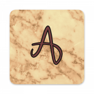

# ArtLookUp

ArtLookUp is a collection of painters and paintings gathered in one place. It was created as a practical exercise for learning Xamarin.Forms development and as a sign of my appreciation and love of classical fine art.

Styles:
- Italian Renaissance
- Northern Renaissance
- Mannerism
- Dutch Baroque
- Flemish Baroque
- Italian Baroque
- Spanish Baroque
- Rococo
- Neoclassicism
- ... more to be added!

# Screenshots

  
  
  
  
  

